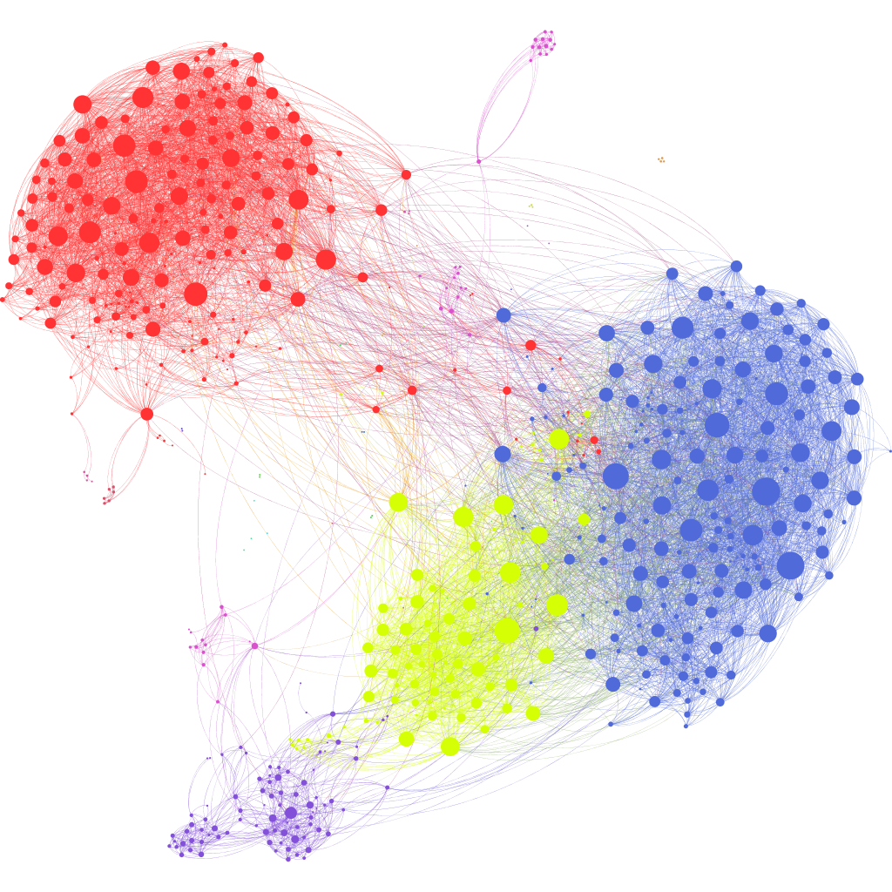

# The Socializing experiment

A repo to try to understand and/or predict the probability for people to connect based on pre-defined real-world based decisive factors

This project tries to modelize predictive socializing behaviors between people based on different relevant factors such as age, gender, hobbies, to try to understand why some people in a group match and why some others don't. It's a truly fascinating science!
