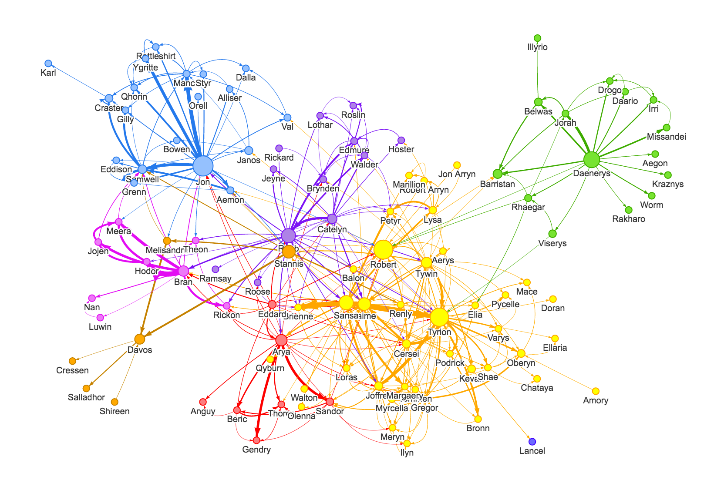

# The Socializing experiment

A repo to try to understand and/or predict the probability for people to connect based on pre-defined real-world based decisive factors

This project tries to modelize predictive socializing behaviors between people based on different relevant factors such as age, gender, hobbies, to try to understand why some people in a group match and why some others don't. It's a truly fascinating science!

#### Defining the social graph

A **social graph** is a graph "Graph (discrete mathematics)") that represents social relations between entities. It is a **model** or **representation** of a social network. The social graph has been referred to as "the global mapping of everybody and how they're related". In the graph below, each person is represented by a dot called a node, and the relationshio from one person to another is represented by a line.

#### Did you know?

As of 2010, Facebook's social graph is the largest social network dataset in the world, and it contains the largest number of defined relationships between the largest number of people among all websites because it is the most widely used social networking service in the world.

#### Can we predict connections between people?

What would it look like if we just had nodes and tried to recreate a socializing experience. What friendships would end up forming? It's the question we're asking ourselves today. The goal is the understand (if there is one) the science between the socialization process. It turns out there a rules:

**First rule:** people tend to become friends with people like them. The more traits you share with someone, the more likely you'll become friends.

- sense of humor
- country
- city
- gender
- age
- etc

**Second rule:** the more friends you have in common (the shortest the distance <=> the closest friends you have are friends with them), the more likely you are to become friends with that person.

**Third rule**: the more popular someone is (meaning, the more friends someone has), the more likely he is to make new connections. Which is why already popular people tend to become exponentionnaly more connected to others. It's a virtuous circle. The more friends you have, the more you'll make new ones.

_Credits_: This project was inspired by the fouloscopie youtube channel.

_Sources_:

- https://en.wikipedia.org/wiki/Social_graph
